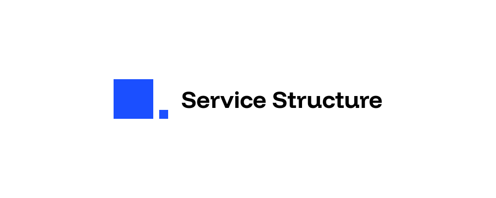
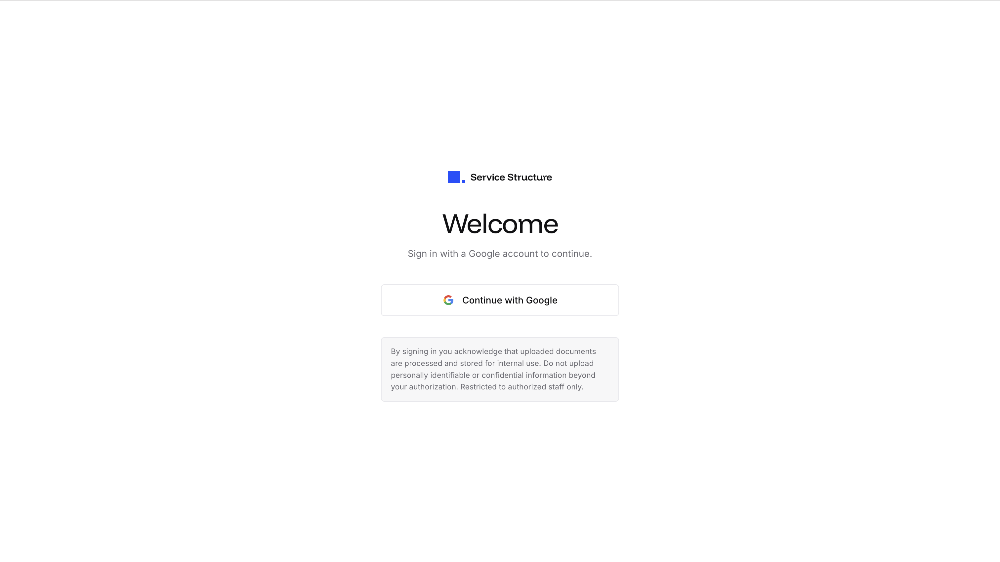
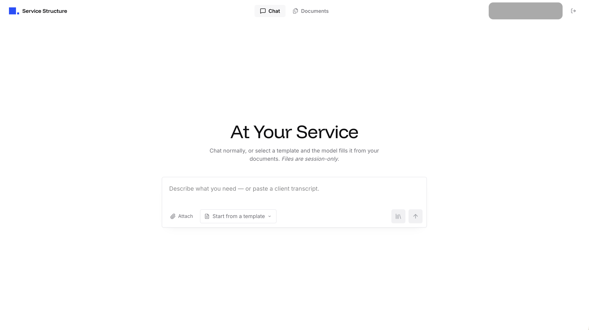

# Service Structure Showcase

> **Architecture:** RAG workspace + schema-validated HTML document templates

An allowlisted knowledge assistant that ingests office documents into a shared vector workspace, answers questions with retrieval-grounded chat, and generates **structured HTML documents** from uploaded templates—validated with Zod, previewed in React, and exported to PDF on the server.

Built as a single **Next.js 16** application deployed to the edge on **Cloudflare Workers** via **OpenNext**, with a full retrieval-augmented generation (RAG) pipeline and a template platform that evolved from markdown payloads to a fixed block grammar and section DAGs.

> **Showcase notice:** This document describes the system design and representative implementation patterns. The public repository omits runnable application source secrets, client payloads, proprietary template copy, production hostnames, and business logos. Screenshots show the **product** brand and UI chrome only (empty or synthetic data). Operational runbooks live alongside the full private codebase when present.

---

## Table of contents

- [What it does](#what-it-does)
- [UI & design](#ui--design)
- [System overview](#system-overview)
- [Stack and why](#stack-and-why)
- [Architecture evolution](#architecture-evolution)
- [Key flows](#key-flows)
  - [1. Document ingestion](#1-document-ingestion)
  - [2. Retrieval](#2-retrieval)
  - [3. Grounded chat](#3-grounded-chat)
  - [4. Template generation](#4-template-generation)
  - [5. PDF export](#5-pdf-export)
- [Auth and access control](#auth-and-access-control)
- [Edge runtime decisions](#edge-runtime-decisions)
- [Project shape](#project-shape)
- [Notable engineering decisions](#notable-engineering-decisions)
- [What I would improve next](#what-i-would-improve-next)

---

## What it does

- **Ingest knowledge documents** (PDF, Word, Excel) uploaded by signed-in users: extract text, chunk, embed, upsert vectors, persist originals and metadata in object storage.
- **Answer questions** with optional workspace retrieval, chunk-level traceability back to source documents, and prompts that steer the model to use provided context when available.
- **Manage a shared template catalog** stored in object storage (not vectorized): JSON envelopes describing HTML or Excel document shells.
- **Generate structured documents** from chat using one of three strategies: conversational markdown, two-phase brief → document compose, or a **section DAG** for graph-registered templates.
- **Preview and export PDFs** using the same React renderer and theme CSS in the dashboard and on a tokenized print route, with headless Chromium on Cloudflare Browser Rendering.

Everything runs behind **Google OAuth** with a server-side email/domain allowlist. There is no anonymous path to model calls or mutating APIs.

---

## UI & design

Product UI (site mark, not a business seal):

| Artifact | Description |
| --- | --- |
| Logo lockup | Icon + **Service Structure** wordmark (above) |
| Favicon | Same icon in the browser tab |
| Login | Google sign-in chrome; no user PII in the layout |
| Chat | Conversation + composer shell (synthetic or empty history in public shots) |
| Documents | Catalog UI captured against an empty local/dev catalog |
| Chat output | Markdown assistant bubble layout |
| Motion | Looping video of the icon “thinking” / buffer animation |

> Public screenshots omit production URLs, real document catalogs, template previews with third-party logos, and any retrieved workspace content.

__Favicon__   
   

__Login__   
   

__Chat__   



---

## System overview

```text
                        ┌──────────────────────────────┐
                        │   Next.js 16 (App Router)    │
                        │   React 19 + Tailwind v4     │
                        │   shadcn/ui + Base UI        │
                        └──────────────┬───────────────┘
                                       │  Route Handlers / Server Actions
                                       ▼
        ┌──────────────────────────────────────────────────────────┐
        │              @opennextjs/cloudflare Worker               │
        │  (nodejs_compat, global_fetch_strictly_public)           │
        └───┬─────────────┬─────────────┬──────────────┬───────────┘
            │             │             │              │
     ┌──────▼─────┐ ┌─────▼──────┐ ┌────▼──────┐ ┌─────▼────────────┐
     │ Cloudflare │ │  Pinecone  │ │  OpenAI   │ │   Anthropic      │
     │    R2      │ │  (vectors) │ │(embeddings│ │  (Claude)        │
     │ documents, │ │            │ │  1536-d)  │ │                  │
     │ templates, │ │            │ │           │ │                  │
     │ print sess.│ │            │ │           │ │                  │
     └────────────┘ └────────────┘ └───────────┘ └──────────────────┘
            │
            │  POST /api/templates/export/pdf
            ▼
     ┌──────────────────────┐
     │ Browser Rendering    │
     │ (Puppeteer pdf())    │──► GET /print/document/:sessionId?token=…
     └──────────────────────┘         same DocumentPreview + theme CSS
```

Retrieval “graph” context is not a graph database. It is a lightweight rank over document metadata in object storage (name-contains scoring), run in parallel with Pinecone vector search. An early Neo4j integration was removed when the stack consolidated onto Workers.

---

## Stack and why

| Layer | Choice | Why |
| --- | --- | --- |
| Framework | Next.js 16 (App Router) | Server Components for dashboards, Route Handlers for APIs, streaming-friendly chat UX. |
| Hosting | Cloudflare Workers via `@opennextjs/cloudflare` | Global edge, R2 and Browser bindings on the same runtime, no cross-cloud egress for file reads. |
| Storage | Cloudflare R2 | Documents, ingestion metadata, template catalog, ephemeral print sessions. |
| Vectors | Pinecone | Managed serverless index; embedding dimension negotiated with index describe. |
| Embeddings | OpenAI `text-embedding-3-small` | Default 1536-d; strong cost/quality for document chunks. |
| Generation | Anthropic Claude | Instruction following for JSON legs, section fills, and grounded chat; usage logged via callbacks. |
| Auth | NextAuth (JWT) + Google OAuth | No session database; allowlist enforced in `signIn`. |
| UI | React 19, Tailwind v4, shadcn/ui, Base UI | Owned components, design tokens for chat and document preview. |
| Chat Markdown | Streamdown | Assistant bubbles render Markdown with code/math/CJK plugins. |
| Validation | Zod 4 | Template envelopes, per-block unions, per-DAG-node output schemas. |
| Env | `@t3-oss/env-nextjs` | Typed auth-related env; other secrets via Wrangler at runtime. |
| PDF text | `unpdf` | Workers-compatible PDF text extraction (no native deps). |
| Word | `mammoth`, `word-extractor` | DOCX vs legacy DOC paths after container sniffing. |
| Excel | `xlsx` | Spreadsheet text extraction for ingestion. |
| PDF export | `@cloudflare/puppeteer` + print route | WYSIWYG with dashboard preview; Worker-friendly vs bundling a full layout engine. |
| Sanitization | `sanitize-html` | Inline markdown in blocks; replaces DOMPurify (not Worker-safe). |

There is no separate Express API in the current architecture; route handlers call into `src/server/` and `src/domains/`.

---

## Architecture evolution

Commit history tells a deliberate simplification and specialization story:

| Phase | What changed |
| --- | --- |
| Sidecar era | Next.js UI proxied to a Node Express service for ingestion, RAG, and chat. |
| Markdown templates | Templates stored in R2 only (skipped vector index); chat composed markdown with a template picker. |
| Workers monolith | Express removed; logic moved to `src/server/` compatible with the Worker runtime. |
| Definition-driven chat | `/api/chat/generate` gained conversation vs template fill/update routing from prompts and draft state. |
| Client PDF experiment | `@react-pdf/renderer` in the browser to avoid Worker CPU; later abandoned for layout parity. |
| HTML block documents | Fixed block grammar (`documentType`, `blocks[]`), React `DocumentPreview`, theme CSS per document type. |
| Server PDF | Puppeteer `pdf()` on Cloudflare Browser Rendering; HTML string renderer dropped in favor of a print route. |
| Section DAG | Complex templates split into topological section graphs (LLM + deterministic nodes); assembler merges validated blocks. |
| Two-phase compose | Templates without a registered graph: brief JSON leg → second leg fills full `HtmlDocument`. |
| Hardening | Print session tokens, documents meta manifest for faster listing, LLM/retrieval metrics, structured ingestion errors. |

---

## Key flows

### 1. Document ingestion

Upload → MIME/extension/magic-byte policy → extract text → quality gates → chunk → embed → Pinecone upsert → R2 object + metadata sidecar (and manifest entry for catalog listing).

Representative PDF path (*illustrative; private repo may differ slightly*):

```ts
export async function ingestPdfDocument(params: {
  buffer: Uint8Array;
  originalName: string;
  mimetype: string;
  uploadedBy: string;
}): Promise<IngestPdfResult> {
  // Stable ID + safe R2 key segments from the original filename
  const documentId = generateKnowledgeDocumentId();
  const { displayName, safeKeySegment } = normalizeOriginalFilename(params.originalName);
  const r2Key = `documents/${documentId}-${safeKeySegment}`;

  // Reject early if MIME type, magic bytes, or file size fall outside policy
  validateClientPdfUpload({
    buffer: params.buffer,
    mimetype: params.mimetype,
    size: params.buffer.length,
  });

  // Workers-compatible text extraction (unpdf)
  const { text, numPages } = await extractTextFromPdf(params.buffer);

  // Scanned-only PDFs often extract near-empty strings; fail closed before indexing
  const quality = assessExtractedTextQuality(text, { minChars, warnBelowChars });
  assertMeetsMinimumTextForIndexing(quality, minChars);

  // Persist the original before Pinecone mutation
  await putObject({ key: r2Key, body: params.buffer, contentType: params.mimetype });

  // Chunk → embed → upsert with bounded metadata for citeable RAG
  const chunks = chunkTextByTokens(quality.normalizedText);
  const vectors = await embedTexts(chunks);

  const records = chunks.map((_, i) => ({
    id: `${documentId}_chunk_${i}`,
    values: vectors[i],
    metadata: {
      document_id: documentId,
      document_name: displayName,
      chunk_index: i,
      chunk_count: chunks.length,
      r2_key: r2Key,
      ingestion_pipeline: "pdf_v1",
      // chunk_text stored here (bounded) for citation in chat
    },
  }));

  await vectorIndex.upsert({ records });
  await putDocumentMeta({ id: documentId, name: displayName, r2Key, chunkCount: chunks.length /* … */ });

  return { documentId, r2Key, chunkCount: chunks.length, numPages, pineconeUpserted: records.length };
}
```

Parallel pipelines exist for Word (`ingestion_pipeline: word_v1`) and Excel (`excel_v1`) with format-specific validation in a shared document policy module.

---

**Chunking trade-off** — overlapping character window instead of a BPE tokenizer to avoid bundling ~1 MB of tokenizer tables into the Worker:

```ts
// ~4 characters per token for typical English prose.
// A real BPE tokenizer would be more precise but adds ~1 MB of WASM
// to the Worker bundle — not worth it at this chunk size.
const CHARS_PER_TOKEN = 4;

export function chunkTextByTokens(
  text: string,
  maxTokens = 800,
  overlapTokens = 100,
): string[] {
  const maxChars = maxTokens * CHARS_PER_TOKEN;
  const step = Math.max(1, maxChars - overlapTokens * CHARS_PER_TOKEN);
  // slide window, trim, return non-empty chunks
}
```

---

**Embedding dimension alignment** — prefer env override, else read Pinecone index dimension once and cache:

```ts
// Dimension must match the Pinecone index.
async function getDesiredEmbeddingDimensions(): Promise<number | undefined> {
  const fromEnv = await parseEnvEmbeddingDimensions(); // OPENAI_EMBEDDING_DIMENSIONS
  if (fromEnv !== undefined) return fromEnv;
  return getPineconeIndexDimension();
}
```

---

### 2. Retrieval

Vector search plus metadata-graph ranking, returned as one `RetrievalResult` for chat, DAG fill, and debug query endpoints:

```ts
export async function retrieveContext(params: {
  message: string;
  topK?: number;
  graphLimit?: number;
}): Promise<RetrievalResult> {
  const topK = clamp(params.topK ?? 8, 1, 20);
  const graphLimit = clamp(params.graphLimit ?? 5, 1, 20);

  const [vector] = await embedTexts([params.message]);
  const index = await getPineconeVectorIndex();

  // Parallel: vector NN + lightweight name-contains rank over R2 document meta
  const [pineconeResult, graphContext] = await Promise.all([
    index.query({ vector, topK, includeMetadata: true }),
    queryMetaGraphContext({ query: params.message, limit: graphLimit }),
  ]);

  return {
    query: params.message,
    retrieval: {
      topK,
      chunkCount: pineconeResult.matches.length,
      graphCount: graphContext.length,
    },
    chunks: pineconeResult.matches.map(toRetrievalChunk),
    graphContext,
  };
}
```

---

### 3. Grounded chat

Conversation mode optionally retrieves workspace context, then calls Claude with a system prompt scoped to the product:

```ts
function buildConversationSystemPrompt() {
  return [
    "You are a helpful assistant for Service Structure.",
    "Answer the user's questions and requests clearly and accurately.",
    "Respond in Markdown (headings, lists, bold where useful).",
    "Do not output JSON or template-schema unless the user explicitly asks for structured data.",
    "If document-store context is provided, use it to ground answers and cite or paraphrase it naturally.",
  ].join(" ");
}
```

Responses are Markdown in the chat bubble (Streamdown in the UI). Template mode uses separate system prompts for brief JSON vs full-document compose.

---

### 4. Template generation

Templates are JSON envelopes uploaded to the shared catalog:

```jsonc
{
  "id": "...",
  "name": "...",
  "version": "...",
  "description": "...", // optional
  "document": { ... }  // html or excel shell — see block types below
}
```

- `document.type: "html"` — `documentType` is one of `script`, `workflow`, `checklist`, `reference`, or `diagnostic`; each type has a Zod-validated `header` and a `blocks` array from a fixed union (headings, body, lists, steps, tables, KPIs, callouts, plus type-specific blocks where needed).
- `document.type: "excel"` — header / sheet shell today; schema can grow with tabular catalog needs.

**Routing** — `resolveTemplateRoute()` picks `conversation`, `template_fill`, or `template_update` from prompt verbs, transcript presence, and whether a draft document already exists.

**Three generation paths:**

**Section DAG** *(registered `templateId` only)*
- `SectionGraph`: nodes are `llm` or `deterministic`, executed in topological waves (parallel where independent).
- Each LLM node returns JSON validated against a per-node Zod schema; failures are tracked per node.
- `assembleDocument` merges section drafts; `pageBreak` blocks come from graph `printChaptersBefore`, not from free-form model output.
- Optional cross-validation after assembly for stricter document shapes.
- Transcript facts may be extracted upstream to structure DAG context.

**Two-phase compose** *(templates without a section graph)*
- First leg: strict JSON `{ replyMarkdown, brief }` — chat bubble vs work order.
- Second leg: `composeTemplateDocument` fills the full `HtmlDocument` from the brief + retrieval + transcript.
- One silent retry on invalid JSON / truncation before surfacing `TemplateValidationError`.

**Conversation** — markdown-only assistant leg; no document mutation.

DAG fast path (conceptually):

```ts
if (mode === "template_fill" && hasSectionGraph(template.id)) {
  const dagResult = await executeTemplateDagFill(input);

  return {
    mode,
    replyMarkdown: dagResult.replyMarkdown,
    document: dagResult.document,
    sources,
    failedNodeIds: dagResult.failedNodeIds.length
      ? dagResult.failedNodeIds
      : undefined,
  };
}
```

Presentation is downstream of generation. Themes live under `document-themes/` (`generic` vs `diagnostic` resolved from `documentType`). `DocumentPreview` maps blocks to React; inline strings pass through `sanitize-html`.

---

### 5. PDF export

Evolution: client React-PDF → server HTML strings → print route + Puppeteer (final).

Current flow:

```text
POST /api/templates/export/pdf  (authenticated)
  │
  ├─ 1. Validate the document envelope against the Zod schema
  │
  ├─ 2. Write an ephemeral print session to R2
  │       print-sessions/{uuid}.json
  │
  ├─ 3. Issue a short-lived signed token for the print route
  │       /print/document/:uuid?token=…
  │
  ├─ 4. Puppeteer launches via the BROWSER binding
  │       page.goto(same-origin print URL)
  │       → renders DocumentPreview + theme CSS, identical to dashboard preview
  │
  ├─ 5. pdf() called with type-aware @page / viewport rules
  │       (generic vs diagnostic print CSS)
  │
  ├─ 6. Print session deleted from R2 (one-time use)
  │
  └─ 7. Return application/pdf to the client
```

**Why a print route:** Dashboard preview and PDF share one DOM and one stylesheet bundle per theme. Pagination rules differ (scroll preview vs Chromium print media), but content parity is intentional.

**Auth note:** Puppeteer does not use the user session cookie. A one-time query token validates the print page; export and print handlers both enforce session lifecycle.

---

## Auth and access control

- **Fail-closed:** if both email and domain allowlists are empty, all sign-ins are denied.
- Google only, with `email_verified` checked in the `signIn` callback.
- JWT sessions — no session store on the Worker.
- `requireAuthedUser()` on mutating API routes and sensitive reads.
- Public surfaces: login, NextAuth routes, print page with valid token only.

```ts
async signIn({ account, profile, user }) {
  if (account?.provider !== "google") return false;
  if (profile?.email_verified === false) return false;

  const email = profile?.email ?? user?.email ?? null;
  return isEmailAllowed(email, loadAccessPolicy());
}
```

---

## Edge runtime decisions

The Worker runtime dominated product choices:

| Constraint | Response |
| --- | --- |
| No `process.env` sprawl | Single `getEnvVar` helper: Cloudflare bindings at runtime, `process.env` fallback in `next dev`. |
| No native PDF parsers | `unpdf` for text extraction. |
| No huge tokenizer WASM | Character-based chunker (~4 chars/token). |
| SDK compatibility | `nodejs_compat` + `global_fetch_strictly_public` in Wrangler. |
| DOM sanitization in Workers | `sanitize-html`, not DOMPurify. |
| PDF CPU / layout | Browser Rendering binding, not in-Worker layout engines. |
| Typed bindings | `wrangler types` → `CloudflareEnv` used across server code. |

---

## Project shape

```text
src/
  app/
    (auth)/login/
    api/
      auth/[...nextauth]/
      documents/              # list, upload, meta, download, delete
      chat/generate/          # conversation + template compose
      query/                  # retrieval-only (debug/integration)
      templates/              # catalog CRUD
      templates/export/pdf/   # Puppeteer PDF
    dashboard/                # chat + documents tabs
    print/document/[sessionId]/   # headless print target
  components/document-templates/  # block renderers, DocumentPreview
  document-themes/                # generic + diagnostic CSS
  domains/generation/             # section graphs, DAG executor, assembler
  lib/                            # auth, extraction, file types
  server/                         # ingest, RAG, templates, PDF, R2, Pinecone, policy
docs/showcase/                    # public logo / UI screenshots (product brand only)
```

Proprietary template JSON, registered production graphs, business logos, and operator deployment docs remain in the private codebase and are **not** part of this showcase surface.

---

## Notable engineering decisions

- **Monolith on Workers** — Removed the Express sidecar; one deployable app, thinner operational surface.
- **Templates: markdown → HTML block grammar** — Predictable structure for preview, validation, and PDF; Zod is the contract.
- **DAG vs monolithic JSON** — Section graphs for long, multi-part documents; two-phase brief → document for simpler templates.
- **Generation ≠ presentation** — DAG output is JSON blocks; CSS themes and React rendering are separate layers.
- **PDF fidelity over client generation** — Print route guarantees the export matches what users preview.
- **One retrieval shape, many consumers** — Same `RetrievalResult` for chat, DAG context, and `/api/query`.
- **Ingestion policy as code** — MIME, size, magic bytes, minimum extractable text, structured errors—tunable without redeploying prompts.
- **Templates not in the vector index** — Catalog files in R2; knowledge docs in Pinecone—clear separation of concerns.
- **Observability hooks** — LLM usage callbacks, retrieval metrics, prompt character counts on compose legs.
- **Fail-closed auth everywhere** — No anonymous model or mutation paths.

---

## What I would improve next

- Reranker over vector + meta-graph candidates for multi-hop questions.
- Real tokenizer chunking when Worker bundle budget allows.
- Streaming partial document JSON in the UI during DAG waves (field- or section-level).
- Eval harness — fixtures of `(template, transcript, expected document shape)` replayed against a pinned model.
- Async ingestion queue for large files and back-pressure on embed/upsert.
- Per-tenant workspaces — today is shared corpus + allowlist; fine for a single org, not multi-tenant SaaS.
- Broader API integration tests — expand beyond unit tests on auth, RAG errors, and export paths.

---

*This showcase describes a system built end-to-end: multi-format ingestion, RAG retrieval, grounded chat, schema-driven HTML templates, section DAG generation, Worker-native runtime choices, and server-side PDF export with preview parity.*
